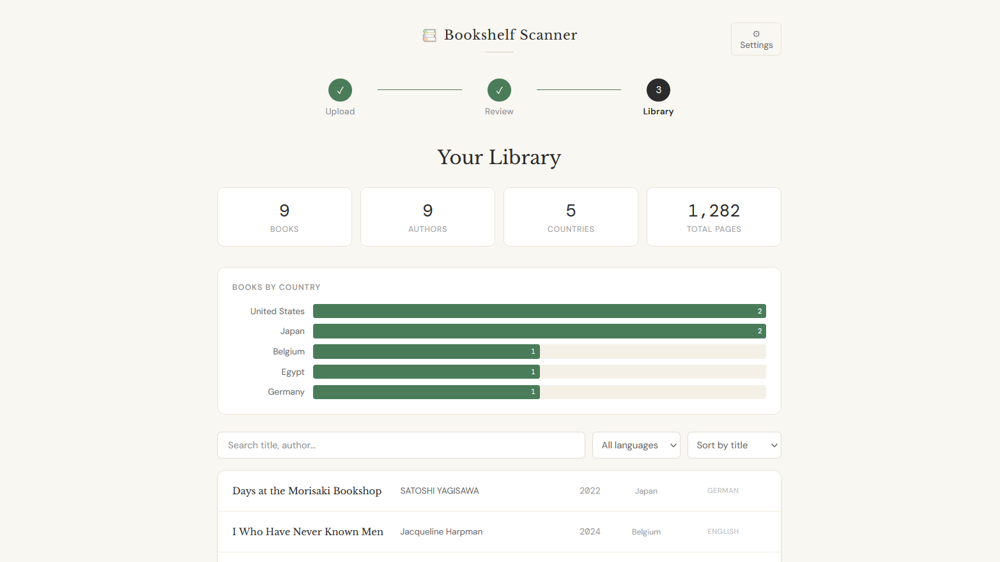
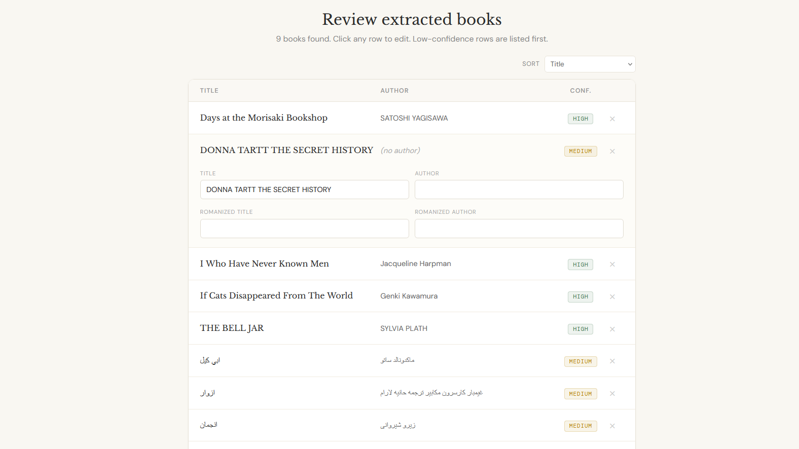
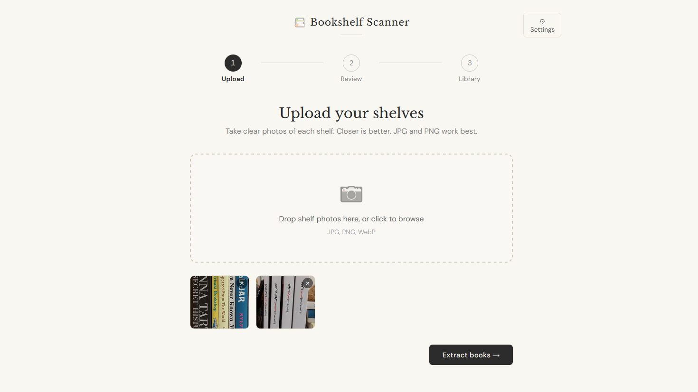

# Bookshelf Scanner 📚

A small web app that turns photos of your bookshelves into a structured, searchable catalog. Point your phone at a shelf, upload the photos, and the app extracts every title using a vision model, fills in metadata, and saves the result locally.

Built to handle multilingual libraries, with particular attention to Persian/non-Latin script.




## The problem

I have a few hundred books across two languages and no catalog. I want to be able to answer simple questions about my library: how many Iranian authors do I own, what decade are most of these from, which languages are over-represented. Manually entering each title into a spreadsheet is tedious, and existing barcode-scanning apps miss most Persian-language editions entirely (no ISBN, no barcode, or simply not in their database).

## The solution

Upload photos of your shelves. The app does three things:

1. **Reads the spines** with a vision-language model (Qwen2.5-VL-72B by default) and returns each book in both the original script and a romanization, with a confidence score.
2. **Lets you review** the results in an editable table, sorted with the least-confident readings first, so you fix only what needs fixing.
3. **Fills in metadata** from Open Library (year, pages, ISBN, cover image), with an LLM fallback for fields the API doesn't reliably return (author's country of origin, in particular).

The final catalog lives in your browser's IndexedDB and can be exported to CSV or JSON whenever you want.

## Getting started

You need Node.js 18 or higher and a free [HuggingFace token](https://huggingface.co/settings/tokens) (a read token is enough).

```bash
git clone https://github.com/MahshadSa/bookshelf-scanner.git
cd bookshelf-scanner
npm install
npm run dev
```

The app opens at `http://localhost:3000`. On first launch it asks you to paste your HuggingFace token, which is stored locally in IndexedDB and never sent anywhere except HuggingFace itself.

That is the whole setup. No backend, no database, no Python.

## How it works

```
Shelf photos
    -> Vision model (extractor.js)        # reads spines, returns JSON
    -> Fuzzy dedup (text.js)              # script-aware, handles ZWNJ / Arabic-vs-Persian
    -> Human review (ReviewScreen.jsx)    # fix the rows that need fixing
    -> Open Library + LLM fallback        # fill year, country, genre, pages
    -> IndexedDB (library.js)             # persistent local catalog
    -> Dashboard / search / export
```

### Project structure

```
bookshelf-scanner/
├── index.html
├── package.json
├── vite.config.js
└── src/
    ├── App.jsx                         # state machine: Upload -> Review -> Library
    ├── main.jsx                        # entry point
    ├── index.css                       # global styles + Persian font fallback
    │
    ├── api/
    │   ├── extractor.js                # vision model call, JSON parsing, batch dedup
    │   └── enricher.js                 # Open Library + LLM fallback
    │
    ├── components/
    │   ├── ui.jsx                      # Button, ConfidenceBadge, Stepper, ProgressBar
    │   ├── UploadScreen.jsx            # drag-and-drop, file list
    │   ├── ReviewScreen.jsx            # editable table sorted by confidence
    │   ├── LibraryScreen.jsx           # stats, search, sort, filter, export
    │   └── SettingsModal.jsx           # API key, model choice
    │
    └── lib/
        ├── text.js                     # Persian/Arabic normalization, dedup keys
        └── library.js                  # IndexedDB persistence, CSV/JSON export
```
## Screenshots

**Library view.** Searchable, sortable catalog with per-country breakdown
and CSV/JSON export.


**Review step.** Extracted books are shown in an editable table sorted
by confidence so the rows most likely to need a human eye come first.



**Upload.** Drag and drop shelf photos, then trigger extraction.



## Tech stack

| Layer | Choice | Why |
|---|---|---|
| Framework | React 18 + Vite | Fast dev loop, no build configuration to maintain |
| Vision | Qwen2.5-VL-72B via HuggingFace Router | Handles non-Latin scripts noticeably better than smaller open VLMs; free with HF account |
| Metadata API | Open Library | Free, no key, reasonable coverage for English books |
| Metadata fallback | Qwen2.5-72B (text) via HuggingFace | Fills gaps the API doesn't cover, especially author nationality for Persian authors |
| Storage | IndexedDB (via [`idb-keyval`](https://github.com/jakearchibald/idb-keyval), ~600 bytes) | The data lives on one device; a real database would be ceremony |
| Dedup | Normalized-key matching | Handles ZWNJ, tatweel, and Arabic-vs-Persian character variants |

## Multilingual support

The pipeline is designed for mixed-language libraries. A few specific decisions matter:

- **Both scripts are kept.** The vision model returns each title and author in the original script *and* a romanization. The original script is what you'd want to see in your catalog; the romanization is what Open Library can actually find.
- **Persian/Arabic normalization** runs before search and before deduplication. Persian and Arabic share characters that look identical but have different Unicode code points (Persian ya `ی` U+06CC vs Arabic ya `ي` U+064A, kaf `ک` vs `ك`). Spine text mixes them and so do API indexes, so both sides are normalized to Persian forms. ZWNJ and tatweel are stripped, alef variants folded.
- **The fallback retries with the original script** if the romanized search returns nothing, which sometimes works for less common Persian publishers that Open Library indexes by Persian text.
- **The body font has an Arabic/Persian fallback** so the original-script titles render properly even when the primary serif/sans stack doesn't include those glyphs.

## Design decisions

**Vision model over classical OCR.** A traditional pipeline (spine segmentation, perspective correction, OCR engine, text parsing) takes serious engineering to get right for each edge case. A VLM handles rotated text, partial occlusion, decorative fonts, and mixed scripts in one call. The tradeoff is API dependency, but for a personal tool processing ten images at a time this is the right balance.

**Human-in-the-loop is architectural, not optional.** Vision-model confidence on Persian calligraphic spines drops, and the downstream enrichment is only as good as the title and author it gets. A fast editable table with low-confidence rows surfaced first lets the user fix the 10% that matters without re-reading the 90% that's correct. The confidence is shown as three buckets (high/medium/low), not a precise percentage, because the model's self-report is not a calibrated probability.

**No backend.** An earlier version had a FastAPI server doing the same work. For a single-user local tool, that meant two processes to run, Python to install, and twice as much code to maintain. The vision model and Open Library are both HTTPS APIs that work fine from the browser; IndexedDB handles persistence; the simplification was worth more than the architectural separation. (Caveat: this means the HuggingFace token lives in the browser. That's fine for a tool you run on your own machine; it would not be fine if this were deployed publicly.)

**Two-tier enrichment.** Open Library is reliable for year, pages, and ISBN but rarely returns author nationality. Rather than leaving the field blank, the enricher asks the text model to fill any specific gaps the API left, per-field. This catches author country (the field Open Library is worst at) without overwriting good API data with model guesses.

**Genre as a controlled vocabulary.** Open Library `subject` arrays contain things like "Accessible book" and "Internet Archive Wayback Machine" alongside actual genres. A keyword map normalizes these to a small fixed set (Fiction, Non-fiction, History, etc.) so the dashboard doesn't get cluttered.

## Roadmap

- [ ] Cover image thumbnails in the library list
- [ ] Reading status (read / unread / in progress) with notes
- [ ] HEIC support via client-side conversion (iPhone exports)
- [ ] Decade and language breakdowns alongside the country chart
- [ ] Back up / restore the library via JSON import

## License

MIT
